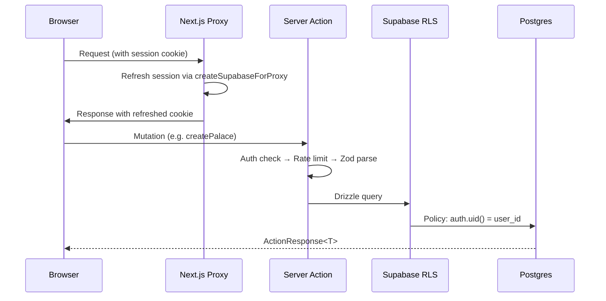
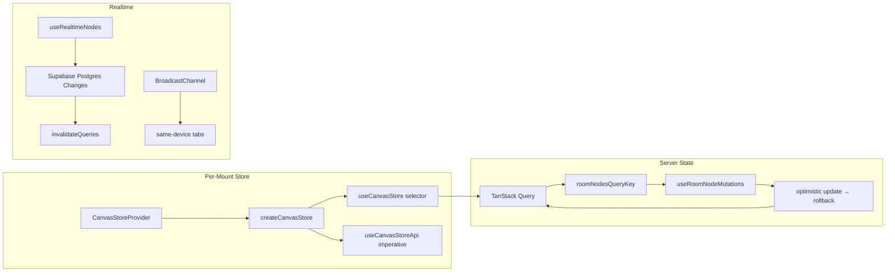
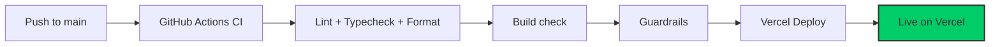

# Memory Palace App

A spatial, interactive learning platform where users create virtual "palaces" with rooms containing draggable memory nodes on a 2D canvas.

[](https://github.com/kristianbraila/memory-palace-app/actions)
[](https://github.com/kristianbraila/memory-palace-app/actions)

---

## Table of Contents

- [Overview](#overview)
- [Architecture](#architecture)
- [Directory Structure](#directory-structure)
- [Page Routes](#page-routes)
- [Getting Started](#getting-started)
- [Development](#development)
- [Testing](#testing)
- [Deployment](#deployment)
- [Contributing](#contributing)
- [Documentation](#documentation)

---

## Overview

**Memory Palace App** is a full-stack spatial learning tool built on Next.js 16 App Router, Supabase, and React Flow. Users organize knowledge as draggable nodes on a 2D canvas inside hierarchical palace → room structures.

- 🏛️ **Spatial Canvas** — drag-and-drop memory nodes on a React Flow canvas with snap-to-grid, multi-select, and context menus
- 🔍 **Full-Text Search** — PostgreSQL GIN index with `websearch_to_tsquery` for natural-language node search
- ⌨️ **Command Palette** — `Cmd+K` universal palette and `?` shortcuts overlay built on `cmdk`
- 🔐 **Secure by Default** — cookie-based auth via `@supabase/ssr`, RLS on all 7 tables, rate limiting via Upstash Redis
- 📤 **Data Portability** — versioned JSON export/import through `/settings`
- 🌙 **Dark Mode** — system, light, and dark via `next-themes` with a 3-way toggle
- ✅ **Tested** — 211+ Vitest unit/component tests; Playwright for canvas drag-and-drop flows

---

## Architecture

### Tech Stack

```mermaid
graph TB
    A[Next.js 16.2 App Router] --> B[React 19 + TypeScript strict]
    B --> C[Tailwind v4 + shadcn/ui]
    C --> D[Vercel]

    E[Supabase Auth / @supabase/ssr] --> A
    F[Drizzle ORM + Supabase Postgres] --> A
    G[@xyflow/react v12] --> B
    H[Zustand v5 CanvasStoreProvider] --> G
    I[TanStack Query v5] --> B
    J[framer-motion v12] --> B
    K[cmdk Command Palette] --> B
    L[Upstash Redis Rate Limit] --> A

    style D fill:#00cd67,stroke:#333,stroke-width:2px
```

### Data Flow



### Canvas State Architecture



---

## Implementation Status

| Phase  | Description                                                                    | Status      |
| ------ | ------------------------------------------------------------------------------ | ----------- |
| 1      | Foundation & DevOps — monorepo, Supabase auth, CI/CD, git hooks                | ✅ Complete |
| 2A     | Responsive shell — `DashboardShell`, `Sidebar`, `BottomNav`, drawer            | ✅ Complete |
| 2B     | Theme system — dark/light/system toggle, `next-themes`                         | ✅ Complete |
| 2C     | Base components — `Input`, `Alert`, `Skeleton`, `Sheet`, `Label`, `Card`       | ✅ Complete |
| 3A     | DB schema — 7-table Drizzle schema, migrations, GIN FTS index                  | ✅ Complete |
| 3B     | RLS + server actions — palace CRUD, per-table RLS, auth trigger                | ✅ Complete |
| 3C     | Rate limiting, FTS search, cursor pagination — Upstash, nodes feature          | ✅ Complete |
| 4      | Dashboard & core pages — palace/room CRUD, settings, export/import             | ✅ Complete |
| 4C.3   | Data export/import — versioned JSON via `/api/export`                          | ✅ Complete |
| 5A     | React Flow setup — `CanvasStoreProvider`, `MemoryNode`, `useNodesQuery`        | ✅ Complete |
| 5B     | Drag & persistence — `useRoomNodeMutations`, batch positions, debounced patch  | ✅ Complete |
| 5D     | Advanced canvas UX — FAB, `NodeToolbar`, context menus, snap-to-grid           | ✅ Complete |
| 6      | Command palette & shortcuts — `cmdk`, `useGlobalShortcuts`, `ShortcutsOverlay` | ✅ Complete |
| 7      | Animations & polish — `framer-motion`, `PageTransition`, ADR 7                 | ✅ Complete |
| ADR 8  | Post-6/7 refactor                                                              | ✅ Complete |
| ADR 11 | UX consolidation + ghost-dialog fix                                            | ✅ Complete |
| ADR 12 | Route-race fix + loading skeletons                                             | ✅ Complete |
| 5C     | Realtime sync & offline                                                        | ⬜ Next     |
| 8A/8B  | Performance hardening                                                          | ⬜ Planned  |

---

## Directory Structure

```
memory-palace-app/
├── apps/
│   └── web/                          # Next.js 16 App Router
│       └── src/
│           ├── app/
│           │   ├── (auth)/           # /login, /signup, /callback
│           │   ├── (dashboard)/      # /palaces, /settings, canvas routes
│           │   ├── api/              # /api/export route handler
│           │   ├── globals.css       # ⭐ Tailwind v4 theme tokens
│           │   └── layout.tsx        # Root layout — MotionProvider, QueryProvider
│           ├── features/
│           │   ├── auth/             # Login/signup forms + server actions
│           │   ├── dashboard/        # WelcomeBanner, StatsBar, RecentPalaces
│           │   ├── palaces/          # Palace CRUD pages + actions
│           │   ├── rooms/            # Room CRUD pages + actions
│           │   ├── nodes/            # Node actions (getNodesByRoom, searchNodes)
│           │   ├── settings/         # ProfileForm, ExportDataCard, ImportDataCard
│           │   └── spatial-canvas/   # ⭐ React Flow canvas, store, mutations
│           │       ├── components/   # MemoryNode, CanvasToolbar, CanvasFab, NodeEditorSheet
│           │       └── store/        # canvasStore.ts — CanvasStoreProvider
│           └── shared/
│               ├── components/       # AppDialogContext, SearchContext, ThemeProvider
│               ├── hooks/            # useIsMobile, etc.
│               └── lib/              # ⭐ supabase.ts, env.ts, ratelimit.ts, routes.ts
│
├── packages/
│   ├── db/                           # ⭐ Drizzle schema, migrations, client, RLS scripts
│   │   ├── src/schema.ts             # 7-table schema with pgEnum, indexes, relations
│   │   ├── migrations/               # SQL migration files
│   │   └── scripts/apply-rls.mjs    # RLS policy application
│   ├── ui/                           # shadcn primitives + cn() — @memory-palace/ui
│   ├── eslint-config/                # Shared ESLint flat config
│   └── typescript-config/            # Shared tsconfig bases
│
├── playwright/
│   └── tests/
│       ├── auth.spec.ts              # Auth flow E2E
│       └── dashboard-layout.spec.ts  # Dashboard navigation E2E
│
├── docs/
│   ├── adr/                          # Architecture decision records
│   └── archive/                      # Aspirational pre-build docs (reference only)
│
├── scripts/ci/                       # Guardrail checks (proxy.ts, vercel.json)
├── AGENTS.md                         # ⭐ AI agent guide — patterns & conventions
├── ARCHITECTURE.md                   # Current-state architecture decisions
├── ROADMAP.md                        # What is built and what is next
├── turbo.json                        # Turborepo pipeline
├── pnpm-workspace.yaml               # pnpm workspaces
└── vercel.json                       # Vercel deployment config

⭐ = Critical files for understanding the project
```

### Key Directories

| Directory                               | Purpose                                     | Key Files                                   |
| --------------------------------------- | ------------------------------------------- | ------------------------------------------- |
| `apps/web/src/features/spatial-canvas/` | React Flow canvas, Zustand store, mutations | `canvasStore.ts`, `useRoomNodeMutations.ts` |
| `apps/web/src/features/palaces/`        | Palace CRUD pages and server actions        | `actions/`, `components/`                   |
| `apps/web/src/shared/lib/`              | Supabase factories, env, rate limit, routes | `supabase.ts`, `env.ts`                     |
| `packages/db/src/`                      | Drizzle schema, client, types               | `schema.ts`, `client.ts`                    |
| `packages/ui/src/`                      | shadcn primitives                           | `components/`, `lib/cn.ts`                  |
| `playwright/tests/`                     | Playwright E2E specs                        | `auth.spec.ts`                              |

---

## Page Routes

```mermaid
graph LR
    A[/] --> B[Dashboard — WelcomeBanner + StatsBar + RecentPalaces]
    C[/palaces] --> D[Palace list — PalaceCard grid]
    E[/palaces/:id] --> F[Palace detail — room list]
    G[/palaces/:id/rooms/:id] --> H[⭐ Spatial Canvas — React Flow]
    I[/settings] --> J[Profile + Export/Import]
    K[/login] --> L[Auth form]
    M[/signup] --> N[Auth form]

    style H fill:#4CAF50
```

### Route Details

#### Canvas (`/palaces/[palaceId]/rooms/[roomId]`)

The core feature. Renders `SpatialCanvas` with:

- `CanvasStoreProvider` (per-mount Zustand store, never module-scope)
- `useNodesQuery` with server-side `initialData` hydration via TanStack Query
- `useRoomNodeMutations` for optimistic save/patch/batch with rollback
- `useRealtimeNodes` for live Supabase Postgres Changes → cache invalidation
- `CanvasToolbar` (desktop) + `CanvasFab` (mobile), `NodeEditorSheet`, `ContextMenu`

#### Dashboard (`/`)

`WelcomeBanner`, `StatsBar` (palace/room/node counts), `RecentPalaces` (4 latest).

#### Palaces (`/palaces`)

Full CRUD via `CreatePalaceDialog` / `EditPalaceDialog` / `DeletePalaceButton`. Dialogs driven by `AppDialogProvider` — call `openDialog('create-palace')`, never local open state.

#### Settings (`/settings`)

`ProfileForm` via `useActionState`. `ExportDataCard` → `GET /api/export` (versioned JSON). `ImportDataCard` → `importPalaceData` server action with Zod validation and `ON CONFLICT DO NOTHING`.

---

## Getting Started

### Prerequisites

```bash
node --version   # 20+ required
pnpm --version   # 9+ required (installed via corepack)
git --version
```

### Installation

```bash
# Clone
git clone https://github.com/kristianbraila/memory-palace-app.git
cd memory-palace-app

# Install dependencies
pnpm install
```

### Environment Setup

Create `apps/web/.env.local`:

```bash
# Supabase (required)
NEXT_PUBLIC_SUPABASE_URL=https://<project>.supabase.co
NEXT_PUBLIC_SUPABASE_PUBLISHABLE_KEY=sb_publishable_...

# Database — pooled Supavisor connection, port 6543 (required for server actions)
DATABASE_URL=postgresql://postgres.<project>:password@aws-0-region.pooler.supabase.com:6543/postgres

# Upstash Redis (optional — rate limiting is a no-op without these)
UPSTASH_REDIS_REST_URL=https://...
UPSTASH_REDIS_REST_TOKEN=...

# Sentry (optional — no-ops when absent)
NEXT_PUBLIC_SENTRY_DSN=https://...
```

Env vars are validated by `apps/web/src/shared/lib/env.ts` on boot — missing or malformed values produce a clear error immediately.

### Quick Start

```bash
pnpm turbo dev
```

Open [http://localhost:3000](http://localhost:3000). You should see:

- ✅ Login page (or dashboard if already authenticated)
- ✅ Dark/light mode toggle
- ✅ Sidebar navigation

---

## Development

### Commands

```bash
# Dev server
pnpm turbo dev                    # http://localhost:3000

# Quality checks
pnpm turbo lint                   # ESLint across all packages
pnpm turbo typecheck              # TypeScript strict check
pnpm format                       # Prettier auto-fix
pnpm format:check                 # Check formatting (CI)

# Guardrails
pnpm check:guardrails             # Ensure proxy.ts not middleware.ts
pnpm check:vercel-config          # Validate vercel.json

# Build
pnpm turbo build                  # Production build

# Testing
pnpm exec playwright test         # E2E headless

# Database
pnpm --filter @memory-palace/db generate   # New migration (after schema change)
pnpm --filter @memory-palace/db push       # Apply schema
pnpm --filter @memory-palace/db studio     # Drizzle Studio GUI

# Local Supabase (requires Docker)
npx supabase start
```

### Critical Patterns

**Server Actions** — every mutating action follows: auth check → rate limit → Zod parse → Drizzle query → return `ActionResponse<T>`.

**Canvas state** — use `useCanvasStore(selector)` for reactive reads, `useCanvasStoreApi().getState()` for imperative event handlers. Never instantiate `createCanvasStore` at module scope.

**Dialogs** — `CreatePalaceDialog` and `CreateRoomDialog` are driven by `AppDialogProvider`. Call `openDialog('create-palace' | 'create-room')`. Never use local open state — broken under React 19 Strict Mode remounts.

**Imports** — Drizzle helpers (`eq`, `and`, `sql`, `desc`) must come from `@memory-palace/db`, not `drizzle-orm`. `cn` from `@memory-palace/ui`. Supabase clients only via `shared/lib/supabase.ts`.

**Routing middleware** — Next.js 16 uses `src/proxy.ts`, not `middleware.ts`. A CI guardrail enforces this.

### Feature Isolation

`src/features/<domain>/` directories exist for: `auth`, `dashboard`, `palaces`, `nodes`, `rooms`, `settings`, `spatial-canvas`. Cross-feature imports are forbidden by `eslint-plugin-boundaries`. Cross-cutting code goes to `src/shared/`.

---

## Testing

### Test Layers

```
                    ╱╲
                   ╱  ╲
                  ╱ E2E ╲          Playwright — drag-and-drop, auth flows
                 ╱────────╲
                ╱Integration╲      Server Actions + real DB + rate limiting
               ╱──────────────╲
              ╱   Component     ╲   Vitest + React Testing Library
             ╱────────────────────╲
            ╱      Unit Tests       ╲  Vitest — pure functions, Zod schemas
           ╱──────────────────────────╲
```

Canvas drag-and-drop requires Playwright — JSDOM cannot simulate React Flow pointer events.

### Running Tests

```bash
# Unit + component (Vitest)
pnpm --filter web test             # Run all Vitest tests
pnpm --filter web test --watch     # Watch mode

# E2E (Playwright — requires dev server running)
pnpm exec playwright test
pnpm exec playwright test --ui     # Interactive UI mode
pnpm exec playwright test --headed # Headed mode
pnpm exec playwright test tests/auth.spec.ts  # Specific file
```

### Test Coverage

- **211+ Vitest tests** across unit, component, and integration layers
- **2 Playwright specs** — `auth.spec.ts`, `dashboard-layout.spec.ts`
- **CI gate** — lint + typecheck + format + build + guardrails run on every PR

### Adding Tests

- Unit/component tests: co-located `__tests__/` beside the file under test
- E2E specs: `playwright/tests/<name>.spec.ts`
- Use `getByRole()`, `getByLabel()` over test IDs where possible
- Canvas interactions always go in Playwright, not Vitest

See [TESTING.md](./TESTING.md) for the full strategy.

---

## Deployment

### Vercel (Production)

Automatic deployment on push to `main`.



**Required Vercel env vars:** `NEXT_PUBLIC_SUPABASE_URL`, `NEXT_PUBLIC_SUPABASE_PUBLISHABLE_KEY`, `DATABASE_URL`, `UPSTASH_REDIS_REST_URL`, `UPSTASH_REDIS_REST_TOKEN`.

### CI Pipeline (GitHub Actions)

Every PR and push to `main` runs:

1. **Lint** — ESLint flat config with `eslint-plugin-boundaries`
2. **Typecheck** — TypeScript strict across all packages
3. **Format** — Prettier check
4. **Build** — `pnpm turbo build`
5. **Guardrails** — `check:guardrails` (proxy.ts rule) + `check:vercel-config`

---

## Contributing

### Workflow

1. Create a feature branch: `git checkout -b feat/my-feature`
2. Load the relevant [agent skill](./AGENTS.md#skills) before writing in a specialized area
3. Make changes following the patterns in [AGENTS.md](./AGENTS.md)
4. Run `pnpm turbo lint && pnpm turbo typecheck` — both must pass
5. Commit: `git commit -m "feat(canvas): add snap-to-grid toggle"`
6. Open a PR — squash merge only, no direct pushes to `main`

### Commit Format

```
<type>(<scope>): <description>
```

**Types:** `feat`, `fix`, `chore`, `refactor`, `docs`  
**Scope examples:** `canvas`, `auth`, `db`, `nodes`, `palaces`, `rooms`, `settings`, `ui`

Examples:

- `feat(canvas): add snap-to-grid toggle`
- `fix(auth): handle expired session cookie`
- `chore(db): add migration for node tags index`

### Code Style

- TypeScript required on all new files; explicit return types on all exported functions
- Tailwind utility classes only — no inline `style={{}}` props
- `camelCase` variables/functions, `PascalCase` components/types, `kebab-case` file names
- Comments explain _why_, not _what_
- Reduce nesting: prefer early returns and guard clauses
- American English throughout ("color", "initialize")

---

## Documentation

| Document                             | Description                                                        |
| ------------------------------------ | ------------------------------------------------------------------ |
| [ARCHITECTURE.md](./ARCHITECTURE.md) | Current-state stack, Supabase factories, DB schema, RLS            |
| [ROADMAP.md](./ROADMAP.md)           | What is built and what is next                                     |
| [AGENTS.md](./AGENTS.md)             | AI agent guide — patterns, skills, critical conventions            |
| [DEVELOPMENT.md](./DEVELOPMENT.md)   | Branching, CI/CD, daily workflow                                   |
| [TESTING.md](./TESTING.md)           | Testing strategy — Vitest, RTL, Playwright                         |
| [SECURITY.md](./SECURITY.md)         | Threat model, RLS, vulnerability reporting                         |
| [CONTRIBUTING.md](./CONTRIBUTING.md) | PR process, commit conventions                                     |
| [docs/adr/](./docs/adr)              | Architecture decision records — added when phases begin            |
| [docs/archive/](./docs/archive)      | Pre-build aspirational designs — reference only, not authoritative |

---

## License

See [LICENSE](./LICENSE).
